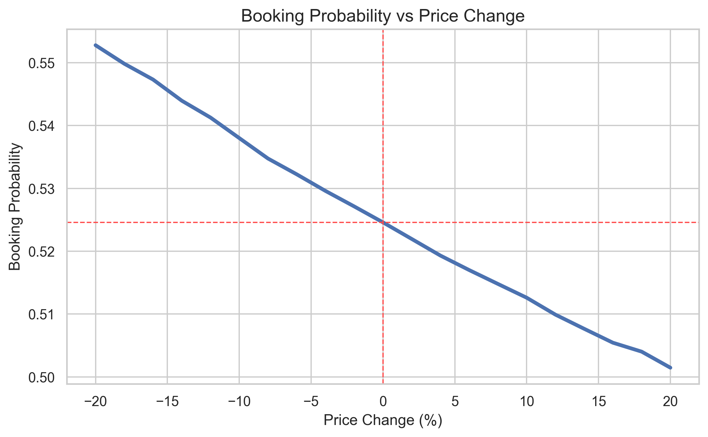
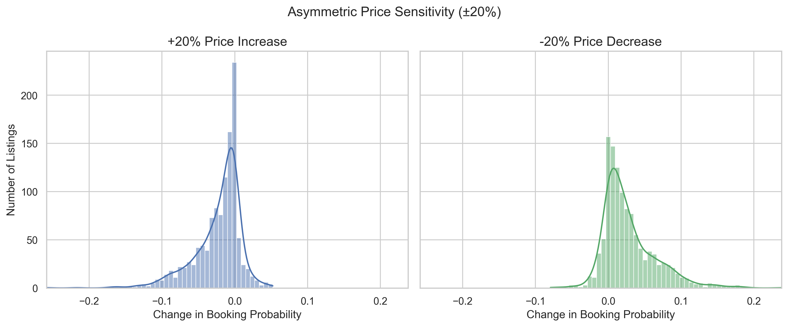
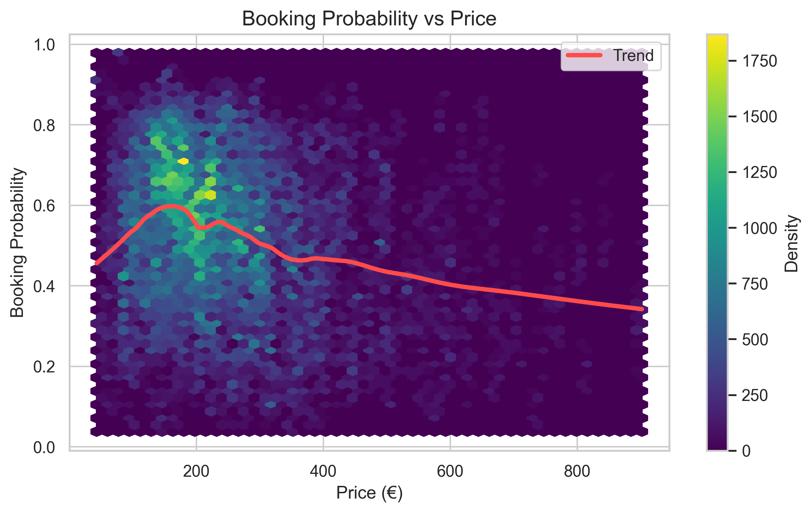
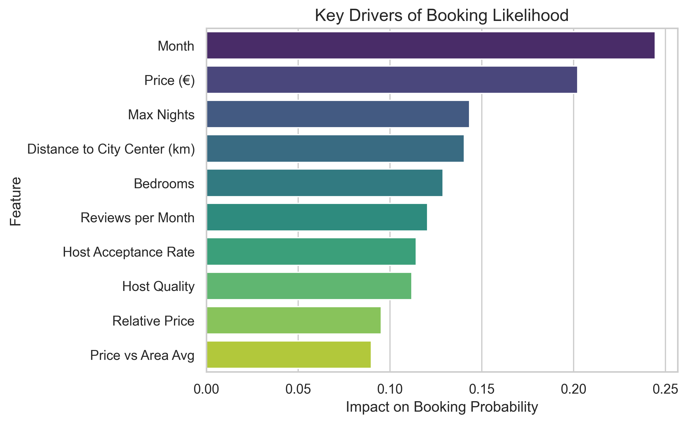
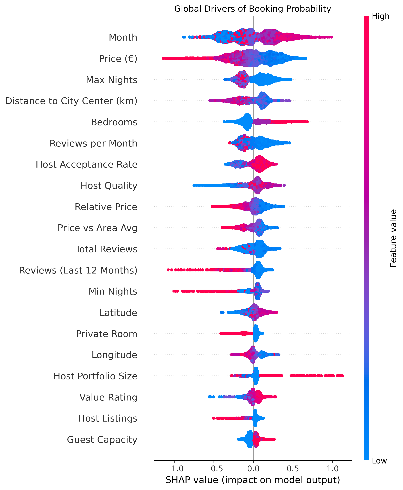
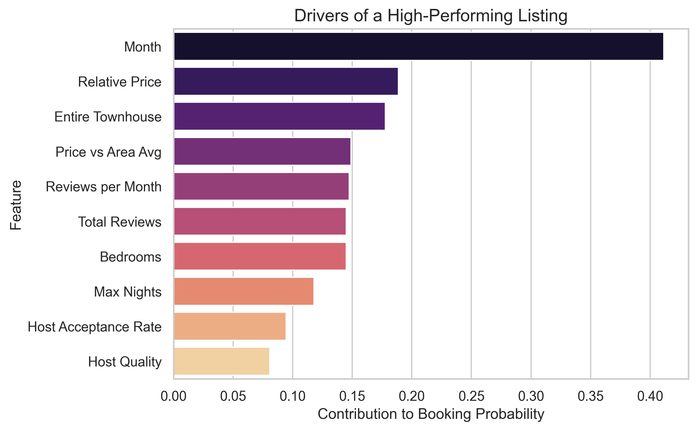
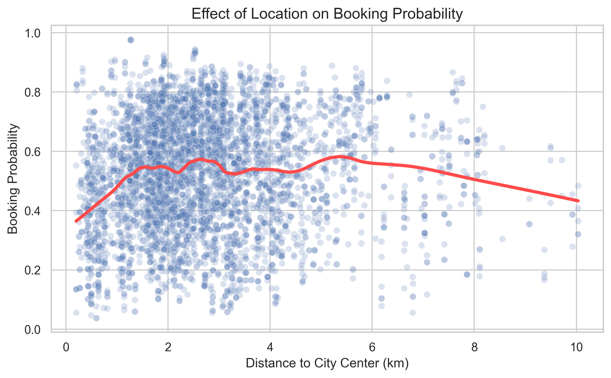

# Airbnb Pricing Optimisation and Booking Probability Modelling

## Overview

This project builds a data-driven framework to understand how Airbnb pricing affects booking probability and what factors most strongly influence user behaviour.

The model is not only used to generate predictions, but also to identify the key drivers of booking decisions through feature importance analysis and model interpretability techniques.

In addition, the project adopts a counterfactual simulation approach by systematically varying the price of a listing while holding all other features constant. This allows us to observe how booking probability responds to controlled price changes and to approximate the underlying demand curve.

In practice, this answers two core questions:

- What factors most influence whether a listing is booked?  
- What happens to booking probability if the price changes?

This shifts the focus from static prediction to decision-oriented modelling. By combining interpretability with simulation, the approach provides actionable insights into both demand drivers and price sensitivity, enabling more informed and data-driven pricing strategies.

---

## Objectives

- Predict booking probability for Airbnb listings over time  
- Identify and quantify the key factors driving booking behaviour  
- Estimate price sensitivity across listings and market segments  
- Simulate demand response under counterfactual price scenarios (−20% to +20%)  
- Provide interpretable, decision-oriented insights to support pricing strategies  

---

## Dataset

Two datasets are used:

- Listings: property, host, and location features  
- Calendar: availability used to infer bookings  

After preprocessing:

- ~2 million observations  
- Train/test split performed at the listing level to prevent leakage  

---

## Methodology

### Feature Engineering

Key features were explicitly engineered to capture pricing context, host quality, and demand signals:

- Neighbourhood average price used as a local market baseline  
- Relative price and price difference to contextualise listing pricing  
- Host quality score (superhost status, response rate, acceptance rate)  
- Review activity (recent vs total reviews)  
- Distance to city centre  
- Seasonality (month, high-season indicator)  

In addition, categorical variables were encoded and key host attributes were transformed into numerical features.

---

### Model

- Machine learning algorithm: XGBoost Classifier  
- Task: Binary classification (booked vs not booked)  
- Class imbalance handled using class weighting  

---

## Model Performance

| Metric    | Value |
|----------|------:|
| Accuracy | 0.665 |
| Precision| 0.720 |
| Recall   | 0.699 |
| F1-score | 0.709 |
| ROC-AUC  | 0.721 |

### Confusion Matrix

|                  | Predicted: Not Booked | Predicted: Booked |
|------------------|---------------------:|------------------:|
| **Actual: Not Booked** | 110,226 | 68,105 |
| **Actual: Booked**     | 75,372  | 175,172 |

**Interpretation**

- The model correctly identifies a large number of bookings (175k true positives), supporting reliable demand estimation  
- False positives (68k) indicate some overestimation of booking likelihood, which is acceptable in a pricing context where missed opportunities are costly  
- False negatives (75k) show that some bookings are not captured, reflecting the influence of unobserved factors (e.g. user behaviour, timing)  

Overall, the model achieves a **balanced trade-off between precision and recall**, making it suitable for **decision support rather than strict classification**, particularly in pricing scenarios where understanding relative demand is more important than perfect prediction.

---

## Results
### Booking Probability vs Price Change



- Booking probability exhibits a clear monotonic response to price changes  
- Increasing price reduces booking likelihood, while decreasing price improves it  
- The relationship is smooth and stable across the tested range, indicating a well-behaved demand curve  

Quantitatively:

- −20% price → ~0.553 booking probability  
- Current price → ~0.525  
- +20% price → ~0.501  

While the direction of the effect is consistent, the magnitude remains relatively small. A moderate increase in price does not lead to a substantial drop in booking probability, suggesting that demand is only weakly sensitive to price within this range.

This indicates that price adjustments can be made with limited impact on bookings, and that non-price factors play a more dominant role in driving demand.

---

### Asymmetric Price Sensitivity



- Demand response is asymmetric: price decreases generate larger gains than equivalent price increases generate losses  
- The distribution reveals substantial heterogeneity across listings  
- While some listings are highly sensitive to price changes, others show relatively small variations in booking probability, indicating low price sensitivity  

This asymmetry is consistent with real-world demand behaviour and suggests that downward price adjustments can be more effective than upward corrections are harmful. At the same time, the limited response observed for a subset of listings indicates that price is not always the dominant driver of demand, reinforcing the importance of non-price factors.

---

### Price vs Booking Probability



- The relationship between price and booking probability is non-linear  
- Mid-range pricing appears optimal, balancing affordability and perceived quality  
- At higher price levels, booking probability declines sharply  

This indicates that pricing operates within a constrained optimal range rather than following a simple linear trade-off.

---

### Feature Importance



The most influential features include:

1. Seasonality (month)  
2. Price  
3. Maximum nights constraint  
4. Distance to city centre  
5. Property size (bedrooms)  
6. Reviews and host quality  

These results highlight that while price is important, **contextual and structural factors dominate booking behaviour**.

---

### SHAP Interpretation (Global)



- Demand response is asymmetric: price decreases generate larger gains in booking probability than equivalent price increases generate losses  
- The distribution is centred close to zero, indicating that for many listings the impact of a ±20% price change is relatively limited  
- However, the spread of the distribution reveals meaningful heterogeneity: a subset of listings exhibits significantly stronger responses to price changes  

This suggests that while price has a consistent directional effect, its magnitude is often modest for a large portion of listings. In other words, small to moderate price adjustments may not substantially affect booking likelihood for many listings, whereas others are more price-sensitive.

Overall, this highlights that price elasticity is not uniform across the market and that pricing strategies should be tailored at the listing or segment level rather than applied uniformly.

---

### Local Explanation (Top Listing)



For a high-performing listing:

- Positive contributions come from favourable seasonality and competitive pricing  
- Strong review signals and host reliability further increase booking likelihood  
- Negative contributions (e.g. location or price deviations) are outweighed by strong positive drivers  

This demonstrates how multiple factors combine to produce high booking performance.

---

### Location Effect



- Booking probability peaks at intermediate distances (~2–5 km from the city centre)  
- Extremely central listings may be overpriced, while distant listings suffer from reduced attractiveness  
- The relationship is non-linear and suggests the presence of an optimal location band  

This reinforces that location interacts with pricing and perceived value rather than acting as a purely monotonic factor.

---

## Price Simulation Framework

To evaluate the impact of pricing decisions, the model is used in a counterfactual setting by simulating price changes:

```python
price_range = np.linspace(0.80, 1.20, 21)
```

For each listing:

1. Adjust the price while keeping other features constant  
2. Recompute booking probability  
3. Measure the resulting change in predicted demand  

This provides an approximation of how booking probability responds to price variations and allows the estimation of listing-level price sensitivity.

---

## Key Insights

- Price has a consistent but relatively modest effect on booking probability  
- Within a ±20% range, changes in price lead to gradual rather than abrupt changes in demand  
- For many listings, moderate price increases do not substantially reduce booking likelihood  
- Demand response is heterogeneous: some listings are more price-sensitive than others  
- Non-price factors (seasonality, location, listing quality) play a dominant role in driving bookings  

Overall, pricing should be considered as one component of a broader strategy, with its effectiveness depending on the specific characteristics of each listing.

---

## Project Structure

```
.
├── data/
├── figures/
│   ├── Price_Change_vs_Probability.png
│   ├── Price_Sensitivity.png
│   ├── Price_vs_Probability.png
│   ├── Feature_Importance.png
│   ├── Shap_Summary.png
│   ├── Location_Effect.png
│   └── Top_Listing_Shap.png
├── metrics.json
├── main.py
└── README.md
```

---

## Tech Stack

- Python (Pandas, NumPy)  
- XGBoost  
- SHAP (model explainability)  
- Seaborn and Matplotlib  
- Statsmodels (LOWESS smoothing)  

---

## Limitations

While the model provides useful insights into booking behaviour and price sensitivity, several limitations should be considered:

- **Absence of cost-related data**  
  The dataset does not include operational costs associated with maintaining a listing (e.g. rent, utilities, cleaning, platform fees), since this information was not available. As a result, the price simulations focus solely on demand (booking probability) and do not account for profitability. This limits the ability to derive fully optimal pricing strategies, as revenue and margin considerations are not incorporated.

- **Observational (non-causal) framework**  
  The model is trained on observational data, meaning that estimated price effects reflect correlations rather than true causal relationships. External factors such as user preferences, competition, and platform dynamics may influence both price and booking outcomes.

- **Limited temporal dynamics**  
  The model does not explicitly capture time-dependent effects such as lead time, day-of-week patterns, or short-term demand fluctuations. These factors can play a significant role in real-world pricing decisions.

- **Uniform price simulation**  
  Price changes are applied uniformly across all listings (±20%), which may not reflect realistic pricing constraints. In practice, optimal price adjustments are likely to vary across segments (e.g. location, property type, demand level).

Despite these limitations, the approach provides a useful approximation of demand response and demonstrates how machine learning can be leveraged to support pricing decisions in a structured and interpretable way.
  
---

## Future Improvements

- **Incorporate cost and profitability modelling**  
  Integrate operational cost data (e.g. rent, utilities, cleaning, platform fees) to move from demand optimisation to profit-aware pricing strategies.

- **Introduce richer temporal dynamics**  
  Include features such as booking lead time, day-of-week effects, holidays, and short-term demand fluctuations to better capture real-world booking behaviour.

- **Estimate causal price effects**  
  Apply causal inference techniques (e.g. uplift modelling or quasi-experimental methods) to distinguish true price impact from observational correlations.

- **Incorporate competitive market context**  
  Model the effect of nearby listings and relative positioning within the market to better reflect real pricing dynamics.

---

## Conclusion

This project extends beyond predictive modelling by incorporating a decision-oriented perspective on pricing and demand.

It addresses not only the question:

"What is the probability of a listing being booked?"

but also:

"What factors drive booking behaviour?"  
"How does booking probability respond to changes in price?"

Through feature importance analysis and model interpretability, the project identifies key drivers of demand, including seasonality, location, listing characteristics, and host quality. These factors are shown to play a dominant role relative to pricing alone.

By combining predictive modelling, interpretability, and counterfactual simulation, the approach provides a structured framework to analyse both demand drivers and price sensitivity.

Overall, the results demonstrate how machine learning can be used not only to predict outcomes, but to support actionable, data-driven decisions in pricing and listing optimisation.

---

## Author

Rami Echriti
MSc Mathematics and Operations Research  
Data Science and Machine Learning
